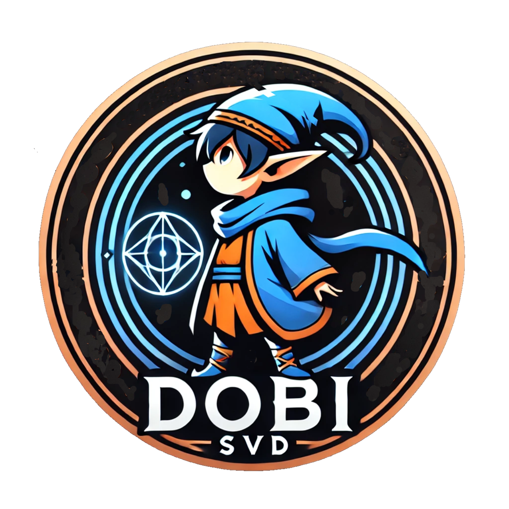
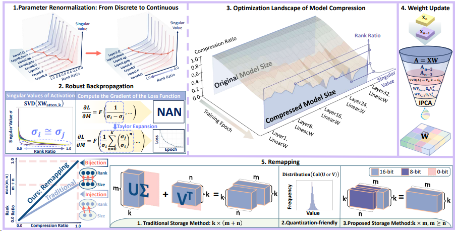

<p align="center">
 <br>
</p>


# Dobi-SVD: Differentiable SVD for LLM Compression and Some New Perspectives


## TL;DR

We provide a new LLM-compression solution via SVD, unlocking new possibilities for LLM compression beyond quantization and pruning. We point out that the optimal use of SVD lies in truncating activations, rather than merely using activations as an optimization distance. Building on this principle, we address three critical challenges in SVD-based LLM compression: including **(1)** How can we determine the optimal activation truncation position for each weight matrix in LLMs? **(2)** How can we efficiently reconstruct the weight matrices based on truncated activations? **(3)** How can we address the inherent "injection" nature that results in the information loss of the SVD? We propose Dobi-SVD, which establishes a new, principled approach to SVD-based LLM compression!

**Paper Link:** [https://arxiv.org/pdf/2502.02723](https://arxiv.org/pdf/2502.02723)

**Project Web:** [https://ah-miu.github.io/Dobi-SVD.page/](https://ah-miu.github.io/Dobi-SVD.page/)




Overview framework of Dobi-SVD: 1-3: Differentiable Truncation Position Training. By applying parameter renormalization for continuous rank ratio selection and using Taylor expansion to prevent gradient explosion, our method enables robust and adaptive optimization of truncation positions. 4: Weight Update. Using IPCA, we sequentially extract and optimally update weight matrix features. 5: Remapping. We resolve a long-overlooked limitation of traditional SVD-based compression through remapping, fully unlocking SVD’s potential for data compression.


**The current release version includes:**

✅  **Models Release:** Models with compression ratios of **0.4, 0.6, 0.8** on **Llama-7b, Llama-2-7b, Llama-13b and Llama-2-13b** using Dobi-SVD. 

✅  **Performance Evaluation:** Perplexity evaluation on wikitext2, c4, ptb and accuracy evaluation on 7 commonsense task sets.

✅  **Complete Implementation Code of Dobi-SVD:** 
  -  Stable differentiable SVD rank training.
  -  Weight update using IPCA.
  -  Remapping storage of decomposed models.


## Demo

Dobi-SVD v.s. BnB Implement on Language question-answering on NVIDIA TITAN Xp 12G and LLaMa-2-7B.

https://github.com/user-attachments/assets/63c43c16-c6b2-4a6f-a197-726de2a234f4

Dobi-SVD v.s. BnB Implement on Vision question-answering on NVIDIA TITAN Xp 12G and LlaVA-v1.5-7B.

https://github.com/user-attachments/assets/9df02262-fa6b-42ae-b2a7-d866506fa80c


## Install

1. Clone the repo and navigate to Dobi-SVD:

```python
git clone https://github.com/wangqinsi1/Dobi-SVD.git
cd Dobi-SVD
```

2. Set up environment:

```python
conda create -yn dobisvd python=3.10
conda activate dobisvd
pip install -e .
```


## Direct Use and Evaluation

We provide some decomposed models, please follow the instructions below to download and use them.

### 1. Download Model

The model weight file is uploaded to Hugingface, you can download them by using the following command.

```python
git clone https://huggingface.co/Qinsi1/DobiSVD-Llama-2-7b-hf-0.4 ./results/compressed_model/Llama-2-7b-hf/DobiSVD-Llama-2-7b-hf-0.4
```

You can replace DobiSVD-Llama-2-7b-hf-0.4 with any release model and put them in the corresponding folder under ./results/compressed_model.

The current release model (0.4 means compression ratio = 40%):

| Model       | Remapping | 0.4                                                          | 0.6                                                          | 0.8                                                          |
| ----------- | --------- | ------------------------------------------------------------ | ------------------------------------------------------------ | ------------------------------------------------------------ |
| Llama-2-7b  | ✅         | [Qinsi1/DobiSVD-Llama-2-7b-hf-0.4](https://huggingface.co/Qinsi1/DobiSVD-Llama-2-7b-hf-0.4) | [Qinsi1/DobiSVD-Llama-2-7b-hf-0.6](https://huggingface.co/Qinsi1/DobiSVD-Llama-2-7b-hf-0.6) | [Qinsi1/DobiSVD-Llama-2-7b-hf-0.8](https://huggingface.co/Qinsi1/DobiSVD-Llama-2-7b-hf-0.8) |
| Llama-7b    | ✅         | [Qinsi1/DobiSVD-Llama-7b-hf-0.4](https://huggingface.co/Qinsi1/DobiSVD-Llama-7b-hf-0.4) | [Qinsi1/DobiSVD-Llama-7b-hf-0.6](https://huggingface.co/Qinsi1/DobiSVD-Llama-7b-hf-0.6) | [Qinsi1/DobiSVD-Llama-7b-hf-0.8](https://huggingface.co/Qinsi1/DobiSVD-Llama-7b-hf-0.8) |
| Llama-2-13b | ✅         | [Qinsi1/DobiSVD-Llama-2-13b-hf-0.4](https://huggingface.co/Qinsi1/DobiSVD-Llama-2-13b-hf-0.4) | [Qinsi1/DobiSVD-Llama-2-13b-hf-0.6](https://huggingface.co/Qinsi1/DobiSVD-Llama-2-13b-hf-0.6) | [Qinsi1/DobiSVD-Llama-2-13b-hf-0.8](https://huggingface.co/Qinsi1/DobiSVD-Llama-2-13b-hf-0.8) |
| Llama-13b   | ✅         | [Qinsi1/DobiSVD-Llama-13b-hf-0.4](https://huggingface.co/Qinsi1/DobiSVD-Llama-13b-hf-0.4) | [Qinsi1/DobiSVD-Llama-13b-hf-0.6](https://huggingface.co/Qinsi1/DobiSVD-Llama-13b-hf-0.6) | [Qinsi1/DobiSVD-Llama-13b-hf-0.8](https://huggingface.co/Qinsi1/DobiSVD-Llama-13b-hf-0.8) |
| Llama-2-7b  | ❌         | [Qinsi1/DobiSVD_Noremapping-Llama-2-7b-hf-0.4](https://huggingface.co/Qinsi1/DobiSVD-Llama-2-7b-hf-0.4) | [Qinsi1/DobiSVD_Noremapping-Llama-2-7b-hf-0.6](https://huggingface.co/Qinsi1/DobiSVD-Llama-2-7b-hf-0.6) | [Qinsi1/DobiSVD_Noremapping-Llama-2-7b-hf-0.8](https://huggingface.co/Qinsi1/DobiSVD-Llama-2-7b-hf-0.8) |

 

### 2. Using Model

You can use the model with the following code (after loading the model, the usage is exactly the same as Llama).
Note that it is recommended to use it in this environment. We found that different versions of transformers can cause differences in model performance.

[Optional] If you want to use jupyter testing, you can install the jupyter kernel in this environment via 

```
conda install ipykernel
ipython kernel install --user --name dobisvd
```


You can easily load and use the model with the following code.

```python
import torch
from transformers import AutoModelForCausalLM, AutoTokenizer
from modelutils import load_remapping_model, load_unremapping_model

# Load the remapping Model
model_id = "./results/compressed_model/Llama-2-7b-hf/DobiSVD-Llama-2-7b-hf-0.4"
model, tokenizer = load_remapping_model(model_id)

# Load the unremapping Model
model_id = "./results/compressed_model/Llama-2-7b-hf/DobiSVD_Noremapping-Llama-2-7b-hf-0.8"
model, tokenizer = load_unremapping_model(model_id)


# Generate Answer (Model usage is exactly the same as Llama)
model = model.cuda()
prompt = "What is the responsibility of the AI assistant?"
inputs = tokenizer(prompt, return_tensors="pt").to(model.device)

outputs = model.generate(**inputs, max_new_tokens=50)
result = tokenizer.decode(outputs[0], skip_special_tokens=True)
print(result)
```


### 3. Evaluate Model

You can quickly start evaluating the task performance of the downloaded model. We provide implementations for quickly evaluating ppl and accuracy on different datasets.  

```python
python evaluate.py \
--updated_model_path COMPRESSED_MODEL_PATH \
--eval_metric {ppl, accuracy} \
--eval_dataset {wikitext2, c4, ptb, arc_easy, arc_challenge, openbookqa, winogrande, hellaswag, piqa, mathqa} \
{--remapping}
```

Examples:

```python
# Evaluate ppl of model after remapping 
CUDA_VISIBLE_DEVICES=0 python evaluate.py --updated_model_path ./results/compressed_model/Llama-2-7b-hf/DobiSVD-Llama-2-7b-hf-0.4 --eval_metric ppl --eval_dataset wikitext2 --remapping

# Evaluate accuracy of model after remapping
CUDA_VISIBLE_DEVICES=0 python evaluate.py --updated_model_path ./results/compressed_model/Llama-2-7b-hf/DobiSVD-Llama-2-7b-hf-0.4 --eval_metric accuracy --eval_dataset arc_easy --remapping

# Evaluate model without remapping
CUDA_VISIBLE_DEVICES=0 python evaluate.py --updated_model_path ./results/compressed_model/Llama-2-7b-hf/DobiSVD_Noremapping-Llama-2-7b-hf-0.8 --eval_metric ppl --eval_dataset wikitext2
```


## Run Dobi-SVD

You can run Dobi-SVD using the following command. This will take several hours to get the optimal rank for each layer of the model. We also provide the optimal rank for the Llama series of models in [./results/training_output/] . You can also use the optimal rank file directly for weight updating.


### 1. Stable differentiable SVD rank training.

Dobi-SVD supports stable backpropagation of low-rank matrices. You can use the following command to find the most appropriate rank for each layer of any model.

```python
python svd_trainer.py \
--model_id PATH_TO_MODEL \
--target_ratio TARGET_RATIO \
--seq_len MODEL_SEQ_LEN \
--seed SAMPLING_SEED \
--training_dataset {wikitext2, c4, ptb} \
--n_train_epochs TRAINING_EPOCHS \
--n_train_samples NUMBER_OF_TRANING_DATA \
{--remapping}

```

Examples:

```python
# You can choose different models and parameters for training.
CUDA_VISIBLE_DEVICES=0,1,2,3 python svd_trainer.py --model_id meta-llama/Llama-2-7b-hf --target_ratio 0.4 --seq_len 2048  --seed 0 --training_dataset wikitext2 --n_train_epochs 20  --n_train_samples 256 --remapping


# For most parameters, we provide recommended default values. You can also simply choose the model and taget ratio and run the following code to implement training.
CUDA_VISIBLE_DEVICES=0,1,2,3 python svd_trainer.py --model_id meta-llama/Llama-2-7b-hf --target_ratio 0.4 --remapping
```

The intermediate and final results of the training will be saved in [./results/training_output/{model_id}/]. 

**We also provide our training results in [./results/training_output/] for your convenience.**


### 2. Weight update using IPCA.

Dobi-SVD supports updating weights using IPCA. You can run the following command to implement it.

```python
python weight_updater.py \
--model_id PATH_TO_MODEL \
--training_result_path PATH_TO_TRAINING_RESULT \
--seed SAMPLING_SEED \
--n_train_samples NUMBER_OF_PERCEPTION_DATA \ 
{--remapping}
```

Examples:

```python
# Update the weight and save the model using remapping methods (please keep the --remapping option consistent with the first step of training).
CUDA_VISIBLE_DEVICES=0 python weight_updater.py --model_id meta-llama/Llama-2-7b-hf --training_result_path Diff-Remapping-0.4_wikitext2_2048 --seed 0 --n_train_samples 256 --remapping

# Update the weight and save the model in regular way.
CUDA_VISIBLE_DEVICES=0 python weight_updater.py --model_id meta-llama/Llama-2-7b-hf --training_result_path Diff-Noremapping-0.8_wikitext2_2048 --n_train_samples 256 --seed 0
```

The updated model will be saved in [./results/compressed_model/].  After that you can use and evaluate it!


## Important Modules

In addition to the above-mentioned Dobi-SVD implementation, our work also includes some important modules. For your convenience, we have separated them into separate files, including:

- Stable SVD backpropagation for low-rank matrices. - [Learn More](modules/stable_svd.py)

- Memory-friendly implementation of incremental IPCA for high-dimensional matrices.- [Learn More](modules/IncrementalPCA.py)

- A storage method that solves the rank restriction of SVD by quantization-friendly U and V.- [Learn More](modules/remapping.py)

  

## Paper and Citation

More technical details can be found in our paper. If you find Dobi-SVD useful or relevant to your project and research, please kindly cite our paper:

```
@inproceedings{
qinsi2025dobisvd,
title={Dobi-{SVD}: Differentiable {SVD} for {LLM} Compression and Some New Perspectives},
author={Wang Qinsi and Jinghan Ke and Masayoshi Tomizuka and Kurt Keutzer and Chenfeng Xu},
booktitle={The Thirteenth International Conference on Learning Representations},
year={2025},
url={https://openreview.net/forum?id=kws76i5XB8}
}
```


## License
This project is licensed under the MIT License.


## Co-First Author Contributions

Differences in the primary contributions of the two co–first authors:

**Qinsi Wang** — Established the optimality of directly truncating activations; identified the root cause of gradient explosion in differentiable SVD in Pytorch; proposed obtaining new weights via IPCA; conducted the majority of experiments and built the VLM demos.

**Jinghan Ke** — Implemented the Taylor-expansion–based solution to the gradient-explosion issue; leveraged quantization-friendly properties to perform remapping, addressing the theoretical bottleneck that singular-value information is under-utilized during truncation; vision-related work: designed the overview figure, created the Dobi-style project page (including several descriptions not present in the paper, reflecting personal perspectives and interpretations), and produced the project video.

Note: The final results were made possible by extensive joint discussion, experimentation, cross-validation, and mutual critique. **When contacting us by email, please include both authors.**

